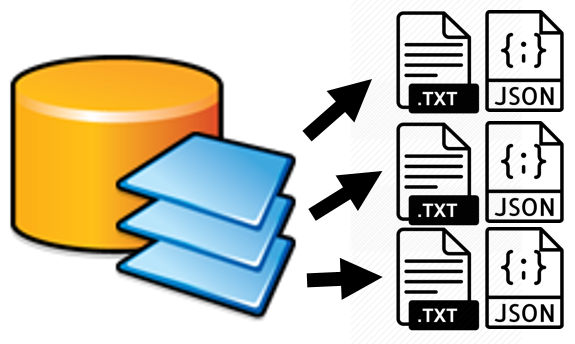

# GeoDBToText

One goal of long term ecosystem monitoring programs is to preserve data for perpetuity. Device and software independent text file formats are preferred to meet this objective.  Additionally, the U.S. government requires non-sensitive data to be publicly available in human and machine readable formats (see https://project-open-data.cio.gov/).

ESRI geodatabases are highly functional for day to day use but are highly likely to be unsupported/unreadable decades in the future and do not meet open data requirements. The GeoDBToText tool prevents data loss by exporting each feature class in an ESRI geodatabase (.mdb) to human and machine text (pipe separated values/WKT, ESRI JSON) file formats. Should the original geodatabase be unusable the text files generated by this tool should still be recoverable. The National Park Service Arctic and Central Alaska Inventory and Monitoring Networks archive proprietary geospatial datasets in tandem with human and machine readable text file formats.

Written by Scott D. Miller, Data manager, National Park Service Arctic Network Inventory and Monitoring Program, Fairbanks, AK.
https://www.nps.gov/im/arcn/index.htm

2019-06-19

Tested against ArcGIS 10.6.1

# How to use
1. Download the files from this GitHub repository and unzip them.
2. Navigate to the files from step 1 and open GeoDBToText.tbx using ArcCatalog.
3. Right click the 'Geodatabase to text files' Python script tool.
4. Click the Source tab
5. Ensure the 'Script file' text box contains the correct path to GeoDBToText.py script.
6. Execute the script by double clicking and follow the prompts

# Notes
The text files will be named according to the feature class they represent and will be exported into the same directory as the source geodatabase. Existing files will be overwritten without confirm.

The tool is configured out of the box to use a pipe | character field delimiter by default to avoid software parsing confusion errors with the comma separated coordinate pairs standard to the Well Known Text geometry format. Users may change the fields delimiter from a pipe to any other character that meets their needs.

# License
U.S. Government Works
Data and content created by government employees within the scope of their employment are not subject to domestic copyright protection under 17 U.S.C. § 105. Government works are by default in the U.S. Public Domain. 

http://www.usa.gov/publicdomain/label/1.0/
